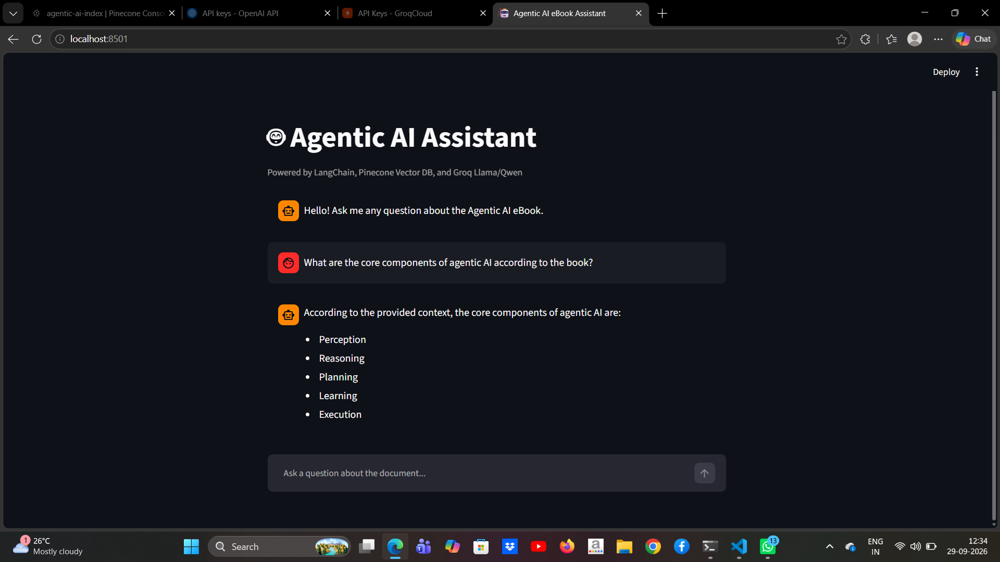

# 🤖 Agentic AI Assistant: Production-Grade RAG Pipeline

[](https://www.python.org/)
[](https://www.langchain.com/)
[](https://www.pinecone.io/)
[](https://groq.com/)
[](https://streamlit.io/)

An end-to-end Retrieval-Augmented Generation (RAG) system built to ingest, index, and conduct hallucination-free question answering over complex domain technical literature (*Agentic AI* eBook).

Designed with a **cost-optimized, high-throughput architecture** utilizing local 384-dimensional dense embeddings to eliminate per-token embedding costs, paired with Groq LPU hardware acceleration for low-latency response generation.

---

## 📸 System Interface



---

## 🏗️ Architecture & Pipeline Flow

```text
   [eBook PDF Source]
           │
           ▼
     [PyPDFLoader] 
           │
           ▼
[Recursive Text Splitter] (chunk_size=1000, chunk_overlap=200)
           │
           ▼
[sentence-transformers: all-MiniLM-L6-v2] (Local Dense 384-dim Embeddings)
           │
           ▼
[Pinecone Serverless Vector Database] (Metric: Cosine Similarity)
           │
   ┌───────┴────────────────────────┐
   ▼                                ▼
[User Input via Streamlit] ──> [Semantic Search (Top-k=3)]
                                    │
                                    ▼
                     [Grounded Context + Prompt Template]
                                    │
                                    ▼
                     [Groq LPU Inference: Qwen 27B / Llama]
                                    │
                                    ▼
                      [Streamlit Rendered Answer]